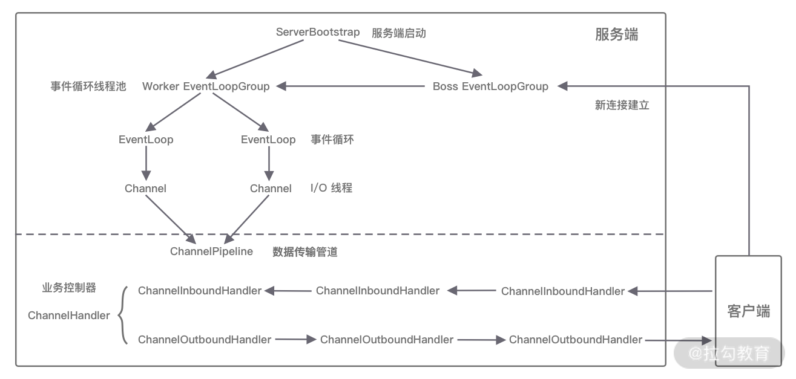
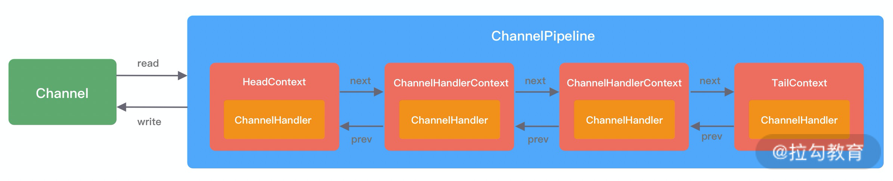
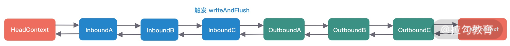

# 组件关系梳理
当你了解每个 Netty 核心组件的概念后。你会好奇这些组件之间如何协作？结合客户端和服务端的交互流程，我画了一张图，为你完整地梳理一遍 Netty 内部逻辑的流转。



- 服务端启动初始化时有 Boss EventLoopGroup 和 Worker EventLoopGroup 两个组件，其中 Boss 负责监听网络连接事件。当有新的网络连接事件(OP_ACCEPT)到达时，则将 Channel 注册到 Worker EventLoopGroup。
- Worker EventLoopGroup 会被分配一个 EventLoop 负责处理该 Channel 的读写事件。每个 EventLoop 都是单线程的，通过 Selector 进行事件循环。
- 当客户端发起 I/O 读写事件时（应该是只会有OP_READ），服务端 EventLoop 会进行数据的读取，然后通过 Pipeline 触发各种监听器进行数据的加工处理。
- 这里图上容易给人造成误解，实际ChannelPipeline和Channel一一对应
- 客户端数据会被传递到 ChannelPipeline 的第一个 ChannelInboundHandler 中，数据处理完成后，将加工完成的数据传递给下一个 ChannelInboundHandler。
- 当数据写回客户端时，会将处理结果在 ChannelPipeline 的 ChannelOutboundHandler 中传播，最后到达客户端。

以上便是 Netty 各个组件的整体交互流程，你只需要对每个组件的工作职责有所了解，心中可以串成一条流水线即可，具体每个组件的实现原理后续课程我们会深入介绍。

## ChannelPipeline


ChannelHandler分为入站 ChannelInboundHandler 和出站 ChannelOutboundHandler 两种处理器。例如
```
        ch.pipeline()
                .addLast(new SampleInBoundHandler("SampleInBoundHandlerA", false))
                .addLast(new SampleInBoundHandler("SampleInBoundHandlerB", false))
                .addLast(new SampleInBoundHandler("SampleInBoundHandlerC", true));
        ch.pipeline()
                .addLast(new SampleOutBoundHandler("SampleOutBoundHandlerA"))
                .addLast(new SampleOutBoundHandler("SampleOutBoundHandlerB"))
                .addLast(new SampleOutBoundHandler("SampleOutBoundHandlerC"));
```
这样形成的链表就是

- Handler链表的头部和尾部都是在DefaultChannelPipeline的构造方法中定义好的。
- 发生读事件（在Netty里也叫输入inbound事件）时，I/O EventLoop线程先从HeadContext中依次向后查找ChannelInboundHandler类型的Handler，并调用其channelRead()方法。当发生写操作outbound事件时，从TailContext中依次向前查找ChannelOutboundHandler类型的Handler，并调用其write()方法。
- 读数据时，ChannelHandler调用顺序是：head,ain,bin,cin,tail
- 写数据时，ChannelHandler调用顺序是：tail(这里不用纠结，关注业务ChannelHandler)?cout,bout,aout,head
- HeadContext 既是 Inbound 处理器，也是 Outbound 处理器。
它分别实现了 ChannelInboundHandler 和 ChannelOutboundHandler。
它是Inbound事件的第一站，也是Outbound事件的最后一站。
- TailContext 只实现了 ChannelInboundHandler 接口。
它会在 ChannelInboundHandler 调用链路的最后一步执行，主要用于终止 Inbound 事件传播，例如释放 Message 数据资源等。
TailContext 节点作为 OutBound 事件传播的第一站，仅仅是将 OutBound 事件传递给上一个节点。
